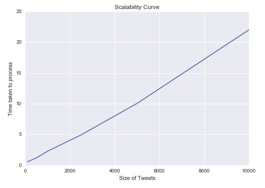

Insight Data Engineering - Coding Challenge Solution
=============================================================
###By Keshav Ramaswamy

## Summary
* The tool built is used to analyze tweets(/hashtags) read as JSON data from an input file and writes the rolling
average degree to an output file.

* Functions:
    - Analyze the hashtag tweets and build a hashtag graph.
    - Update the graph over a 60 second window, continuously reading tweets.
    - Calculate the average degree output for every new tweet read and write the output to an output file.

* The source files are in `src/modules/` and their tests are in `src/modules/tests/`

### Source Files:
1. twitter_hashtag_graph_analyzer.py
2. hashtag_graph.py
3. tweet.py

### Files for unit tests:
1. test_twitter_hashtag_graph_analyzer.py
2. test_hashtag_graph.py
3. test_tweet.py
4. mock_data.py

## Execute the tool:
* Execute the bash script `./run.sh` - The python source file `twitter_hashtag_graph_analyzer.py` is executed
with optional arguments.
* The two arguments it expects - `input_file` and `output_file` are set to their default values:
`./tweet_input/tweets.txt` and `./tweet_output/output.txt`. So no arguments are expected.
* Pass in arguments if some other file path for input or output have to be given as in the manner:
`python ./src/Modules/twitter_hashtag_graph_analyzer.py input_filepath output_filepath` from the terminal.
* Note:
   -  The tool requires the use of library `NetworkX` - use `pip install networkx` to install `NetworkX` manually if the
source files are executed from the terminal. The bash script, `run.sh` will automatically install the library if it's
not installed.
    - The python module, `argparse` is used for command-line argument parsing - use `pip install argparse` to install
    the library.
    - The development is in `Python 2.7` - `run.sh` accepts `python` as Python 2.7 only.

## Tests:
* The unit tests can be executed either by executing `tests/run_tests.sh` from `src/modules/` 
or running `pytest ./tests/` from `src/modules/`from the terminal directly.
* The library `pytest` is required for unit testing. Use `pip install pytest` for installing manually else execute
run_tests.sh which automatically installs the library if not present.
* Additional test suites are added in `/insight_testsuite/tests/`. They can be tested by executing 
`./insight_testsuite/run_tests.sh`

## Implementation
* The hashtag graph is implemented using the mentioned module, NetworkX.
* NetworkX is a python library used for building graphs and networks. The choice for this library is
due to the fact that NetworkX "is suitable for operation on large real-world graphs: e.g., graphs in excess of
10 million nodes and 100 million edges".(See https://networkx.github.io/documentation/latest/)
* The basic graph data structure in NetworkX is a "dictionary of dictionaries of dictionaries" where each node can be any
hashable object - strings, numbers, files or functions while an edge is represented as a tuple of nodes.
* The choice of going for the use of NetworkX instead of "reinventing the wheel" is due to the fact that real world
hashtag graphs are expected to be sparse and NetworkX uses adjacency lists since the storage requirements are the
lowest( proportional to `m + n` for `m` nodes and `n` edges).
* As mentioned earlier, the adjacency list is maintained as a "dictionary of dictionaries of dictionaries" where each
node in the graph is a key whose values are dictionaries with keys as its neighbours mapped to the edge data.
* For example for a graph G with edges,'A - B' and 'B - C' is represented in the form of an adjacency list in the
following manner, with default edge data as 1:
```
G = networkx.Graph()
G.add_edge(’A’,’B’)
G.add_edge(’B’,’C’)
print G.adj
{’A’: {’B’: 1},
’B’: {’A’: 1, ’C’: 1},
’C’: {’B’: 1}}
```
* This choice of data structure contributes to fast lookup or removal of edges and nodes. For more information regarding
the inside of NetworkX, see: http://conference.scipy.org/proceedings/SciPy2008/paper_2/full_text.pdf

## Scalability Results
* After extensive profiling with the python module, `cprofilev` and resulting optimization of the code, the tool was able to scale to the required levels.
* The scalability graph is shown below where it processes 10000 tweets within 22 sec.
* The accompanying analysis is included in an ipython notebook at `./scalability_analysis.ipynb`
* 